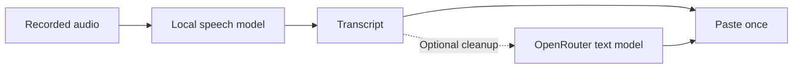

# VoiceCommander

Press a key, talk, then press it again. VoiceCommander types the result wherever
your cursor is.

It is a local-first Windows dictation tool with Whisper, Parakeet, Nemotron,
and Cohere models. Your computer handles transcription by default. If you want
cleaner prose or structured Markdown, an optional OpenRouter step works on the
finished text.

## Use it

| Hotkey | Action |
| --- | --- |
| `F8` | Normal dictation |
| `F7` | Markdown dictation |
| `Ctrl+F8` | Open settings |

New configurations detect the spoken language automatically. You can force a
language in settings when detection needs a hint. Existing language choices are
not reset.


Installed builds start quietly when you sign in, so the hotkeys are ready
without opening the application.

## Where your data goes

The normal path stays local until you choose cloud post-processing. Your audio
goes to the selected model on your computer. OpenRouter receives only the
resulting text when you ask it to clean up prose or produce Markdown.



Cloud transcription is available as an explicit alternative to local models.
That setting sends recorded audio to OpenRouter. Editing and Markdown send
transcript text instead. Every cloud request sets
[`data_collection` to `deny`](https://openrouter.ai/docs/guides/routing/provider-selection),
which restricts routing to providers OpenRouter identifies as non-collecting.
OpenRouter still processes the request and records request metadata under its
own policy.

VoiceCommander stores your API key in Windows Credential Manager, not in its
configuration file. During development, `OPENROUTER_API_KEY` takes precedence.

## Pick a local model

Models download only when selected. Model files and native runtimes are pinned
and verified. On Windows, Parakeet Flash and Nemotron use Vulkan, Cohere chooses
Vulkan automatically, and Parakeet TDT uses DirectML. Each path retains CPU
execution for unsupported work or failed GPU initialization.

| Model | Download | Measured speed | Trade-off |
| --- | ---: | ---: | --- |
| `tiny` | 31 MiB | Not measured yet | Smallest model; favors speed over accuracy |
| `base` | 57 MiB | ~15x | Default and fast |
| `small` | 181 MiB | ~5x | Better recognition while remaining faster than speech |
| `parakeet-tdt-v3` | ~640 MiB | Not measured yet | Automatic detection across 25 European languages |
| `parakeet-tdt-v2` | ~630 MiB | Not measured yet | Higher-accuracy English-only Parakeet |
| `parakeet-flash` | ~123 MiB | Not measured yet | Small, streaming-ready, English only; no punctuation |
| `nemotron-3.5` | ~685 MiB | Not measured yet | Streaming-ready with automatic detection across 40 locales |
| `cohere-transcribe` | ~1.65 GiB | Not measured yet | Heavy multilingual model; choose its language for best results |

The measured speeds come from an 8-thread Ryzen laptop. A speed of 5x means five
seconds of audio takes about one second to transcribe.

## Optional cloud post-processing

At editing strength 0, VoiceCommander pastes the raw transcript. Higher values
send the text to the selected OpenRouter model. You can say commands such as
"scratch that", "new paragraph", and "bullet point" instead of editing by hand.

Whisper and cloud editing can use names and technical terms from Custom
vocabulary. The other local models do not currently support this hint. Separate
terms with commas:

```text
Kubernetes, Postgres, Aleksandr
```

Use `F7` to dictate headings, lists, tables, code blocks, and formulas as raw
Markdown. Inline formulas use `$...$`; display formulas use `$$...$$`.
Markdown mode always requires an OpenRouter API key. If formatting fails,
VoiceCommander reports the error instead of pasting your spoken instructions.

## Live captions

The `VoiceCommander Captions` Start menu shortcut captions audio playing on
your computer in an always-on-top window. Audio stays local. Captions currently
use `base` and arrive about eight seconds behind playback. Language follows the
dictation setting, including automatic detection.

During development, run:

```powershell
uv run voicecommander --captions
```

## Develop and build

VoiceCommander requires Python 3.13 and uses `uv`.

```powershell
uv sync
uv run voicecommander --settings
uv run voicecommander
uv run python -m unittest discover -s tests
```

Install Inno Setup, then build the installer:

```powershell
.\scripts\build.ps1
```

The installer is written to `dist/installer/`.
