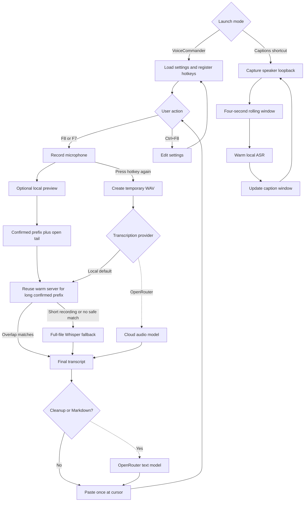
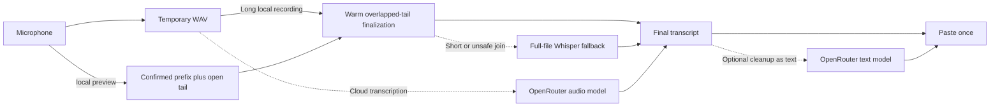

# VoiceCommander

Press a key, talk, then press it again. VoiceCommander types the result wherever
your cursor is.

It is a local-first Windows dictation tool with multilingual Whisper models.
Your computer handles transcription by default. If you want cleaner prose or
structured Markdown, an optional OpenRouter step works on the finished text.

## Use it

| Hotkey | Action |
| --- | --- |
| `F8` | Normal dictation |
| `F7` | Markdown dictation |
| `Ctrl+F8` | Open settings |

New configurations detect the spoken language automatically. You can force a
language in settings when detection needs a hint. Existing language choices are
not reset.

Installed builds start quietly when you sign in, so the hotkeys are ready
without opening the application.

## How it works

VoiceCommander has separate dictation and live-caption launch modes:



## Where your data goes

Each recording becomes a temporary WAV file. With a local preview,
preview, VoiceCommander confirms older segments that agree across consecutive
passes. Every two seconds it decodes an eight-second window that begins two
seconds before the last confirmed point. When that prefix lets a long recording
skip at least 20 seconds, VoiceCommander reuses the warm preview server and
transcribes the remaining audio with the same two-second overlap. It appends the
tail only when at least three words match and the tail adds new words. Short
recordings, cold servers, and unsafe joins use the existing full-file Whisper
transcription. Tentative preview text is never committed.



The solid route is local and is the default. Cloud transcription sends the WAV
file to the audio-capable OpenRouter model ID entered in settings. Editing and
Markdown send only the final transcript. All local models show tentative text
while recording; `small` updates more slowly. You can disable Live local preview
in settings.

Every cloud request sets
[`data_collection` to `deny`](https://openrouter.ai/docs/guides/routing/provider-selection),
which restricts routing to providers OpenRouter identifies as non-collecting.
OpenRouter still processes the request and records request metadata under its
own policy.

VoiceCommander stores your API key in Windows Credential Manager, not in its
configuration file. During development, `OPENROUTER_API_KEY` takes precedence.

## Pick a local model

Models download only when selected. Model files and the native whisper.cpp
runtime are pinned and verified.

| Model | Download | Final | Warm preview | Trade-off |
| --- | ---: | ---: | ---: | --- |
| `tiny` | 31 MiB | 0.56 s | 0.50 s | Fastest live text; lower accuracy |
| `base` | 57 MiB | 0.94 s | 1.00 s | Default; balanced speed and accuracy |
| `small` | 181 MiB | 2.72 s | 3.63 s | Better recognition; slower live text |

Latency is the median of five English runs on the
[bundled 11-second JFK sample](benchmarks/jfk.wav), using whisper.cpp v1.9.1
capped at 8 threads on a Ryzen laptop in Balanced power mode. Final timings
include CLI startup. Preview timings decode the production 8-second window on
the persistent local server after its first request. Lower is better.

These short English timings settle the latency gate only. Long recordings and
German, French, and Spanish still need manual release checks.

## Optional cloud post-processing

At editing strength 0, VoiceCommander pastes the raw transcript. Higher values
send the text to the selected OpenRouter model. You can say commands such as
"scratch that", "new paragraph", and "bullet point" instead of editing by hand.

Whisper and cloud editing can use names and technical terms from Custom
vocabulary. Separate terms with commas:

```text
Kubernetes, Postgres, Aleksandr
```

Use `F7` to dictate headings, lists, tables, code blocks, and formulas as raw
Markdown. Inline formulas use `$...$`; display formulas use `$$...$$`.
Markdown mode always requires an OpenRouter API key. If formatting fails,
VoiceCommander reports the error instead of pasting your spoken instructions.

## Live captions

The `VoiceCommander Captions` Start menu shortcut captions audio playing on
your computer in an always-on-top window. Audio stays local. Captions currently
use a separate model setting, which defaults to `base`. A warm local ASR process
transcribes a four-second rolling window once per second. Language follows the
dictation setting, including automatic detection.

During development, run:

```powershell
uv run voicecommander --captions
```

## Develop and build

VoiceCommander requires Python 3.13 and uses `uv`.

```powershell
uv sync
uv run voicecommander --settings
uv run voicecommander
uv run python -m unittest discover -s tests
uv run python scripts/benchmark_asr.py recording.wav --model base
```

Each dictation has a recording session that owns capture, its timer, preview
state, and final transcription. Stopping capture prevents further preview
updates. Finalization drains the preview worker, cancelling a slow request
after a short grace period, before reusing confirmed text or decoding the full
file. The text pipeline handles refinement and its fallback rules. The app
pastes the completed result and deletes the WAV only after successful delivery.

Shutdown stops capture and preview, prevents further pastes, and waits for
in-flight model downloads or finalization requests before closing the model.
Those requests can delay process exit until they complete or time out.

Install Inno Setup, then build the installer:

```powershell
.\scripts\build.ps1
```

The installer is written to `dist/installer/`.
